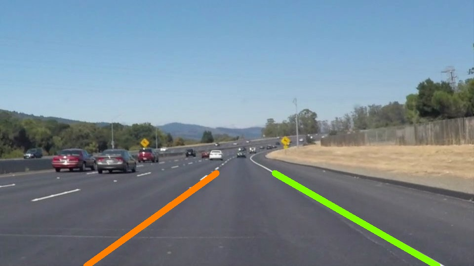
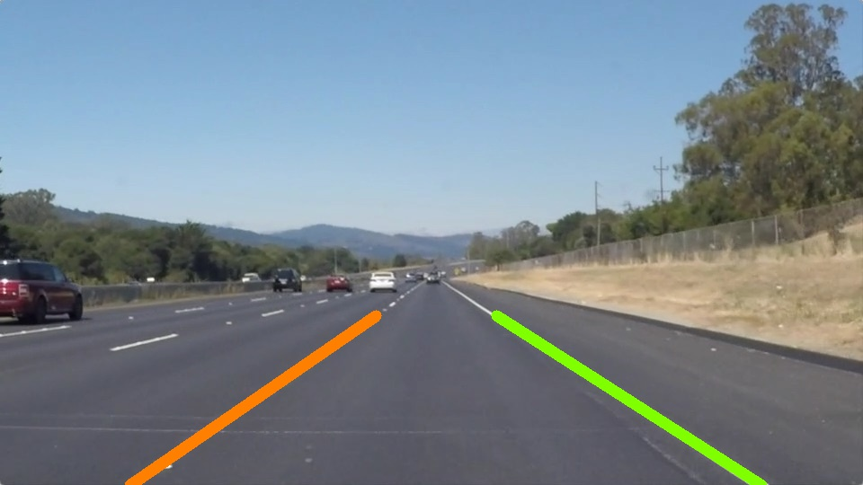

**Finding Lane Lines on the Road** 
---

This project involves finding the lane lines in images and videos, it is the first project in <a href="http://www.udacity.com/drive"> Udacity's Self Driving Car Nanodegree </a>.

Links
---

  <a href="writeup.md">Writeup</a>

  <a href="P1.ipynb"> Code <em></a>(in an iPython notebook)</em>

Sample outputs
---

