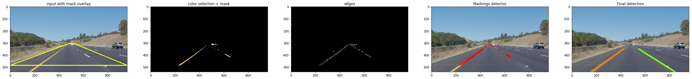
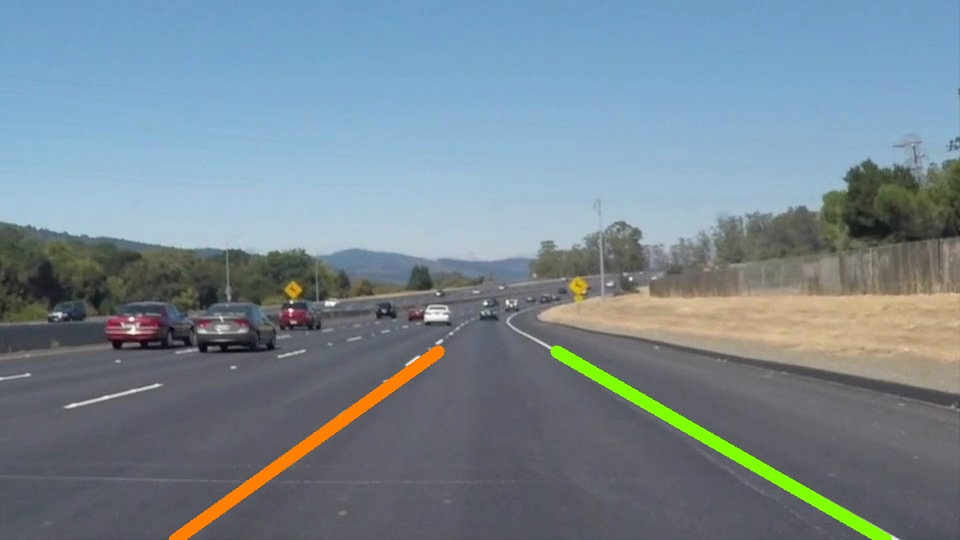
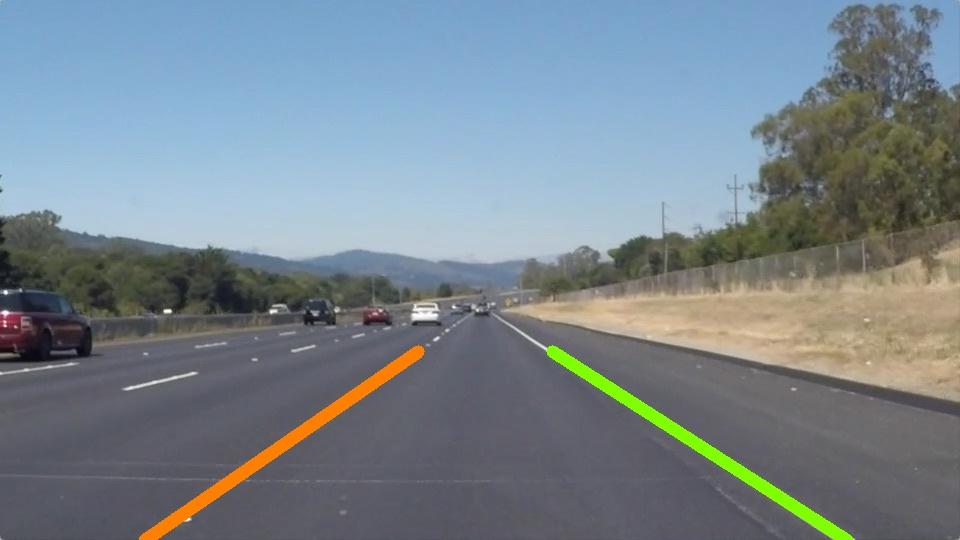
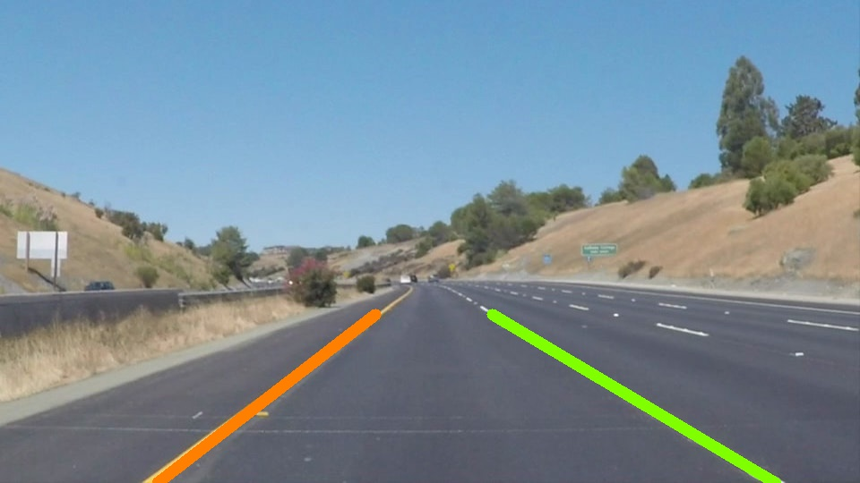
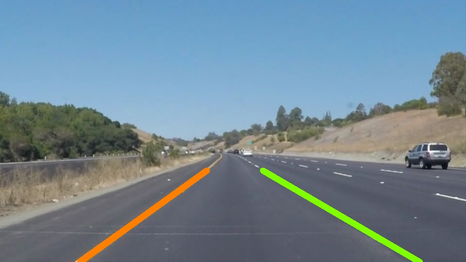
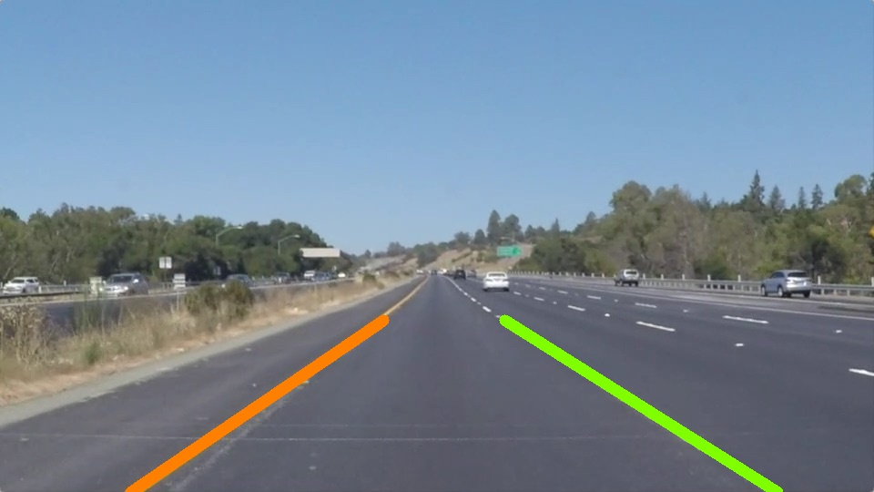
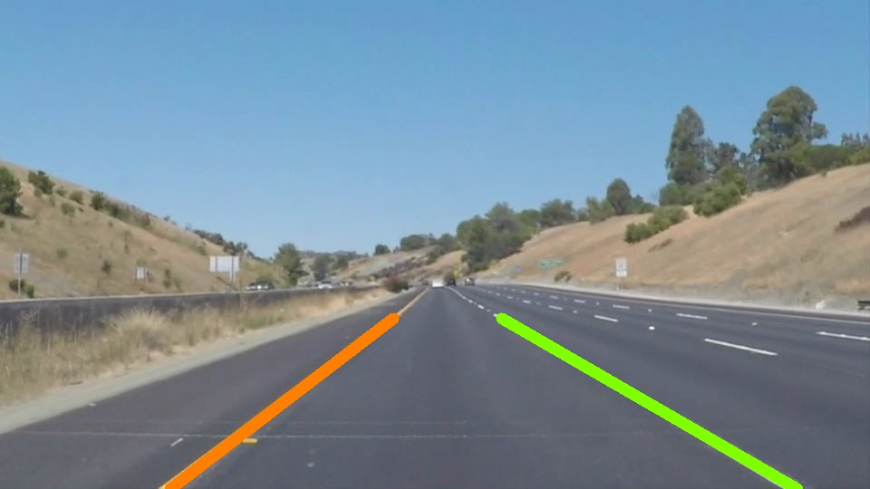

# **Finding Lane Lines on the Road** 

---

**Finding Lane Lines on the Road**

The goals / steps of this project are the following:
* Make a pipeline that finds lane lines on the road
* Reflect on your work in a written report

[//]: # (Image References)

[image1]: ./examples/grayscale.jpg "Grayscale"

---

### Reflection

### 1. Describe your pipeline

My pipeline consisted of instantiating an object defined by the class *LaneFinder* for every frame. The method *show_lanes()* takes a frame and overlays two smooth lines which my pipeline has identified to be lanes. 

My pipeline involved 4 main steps: 

1. Do some basic color selection on the original image. This is implemented by the *filter_colors* method.

2. Blur the image with a quite high radius as a preprocessing step and running a Canny edge detector on it. This is implemented by the *get_edges* method.

3. Run a hough transform to get a list of lines that are likely to be the lane markings. This is implemented by the *get_lines_hough* method. 
> A method named *highlight_markings_detector* returns the image with an overlay of those lines in red which is very useful for debugging.

4. Split the lines by their position in the image - either left or right - and average all the points into two linear lines and display them on the original image. This is implemented by the *show_lanes* method.
> Another way of splitting would be to look at the linear slope of each line but I found that method to be unreliable.

the result gives something like this:

  

#### Summary
In summary my pipeline looks like this:
    
   grayscale **--------|**
                      **------->** edge detection + masking **--->**  Hough Transform **--->** split, average and show two lines
   color selection  **--|**

The method *show_plots()* returns a matplotlib figure showing what happens after each key process which is very useful for tuning different parameters and debugging:

![matplotlib plots][plot.png]

### 2. Identify potential shortcomings with your current pipeline

- My pipeline is very dependent on the sharpness and saturation of the image, using the same program on a different camera would probably give bad results. This is something I experienced when I tried doing the challenge video.

- It is also very dependent on environmental settings. This program probably does not work well if the sun is directly in front of the car, or if it is an overcast day.

- The splitting of points only involves splitting the image down the middle, this means that the camera has to be in the middle of the car. This also means that this program simply would not work on curvy roads.

- Parameter tuning is just tedious.

- The entire program is very dependent on specific parameters, this program does not try to generalize how to find a lane using machine learning techniques.

### 3. Suggest possible improvements to your pipeline

- Make a GUI using matplotlib to make parameter tuning less tedious

- Find a better, more reliable way of splitting points

- Put all the parameters in the constructor of the class to allow reusability across different environmental and imaging settings

- Use machine learning to try to write a program which can generalize lane finding

### Outputs

#### Images

#### Videos

  <a href="test_videos_output/solidWhiteRight.mp4"> solidWhiteRight.mp4 </a>

  <a href="test_videos_output/solidYellowLeft.mp4"> solidYellowLeft.mp4 </a>

  <a href="test_videos_output/challenge.mp4"> challenge.mp4 </a>

